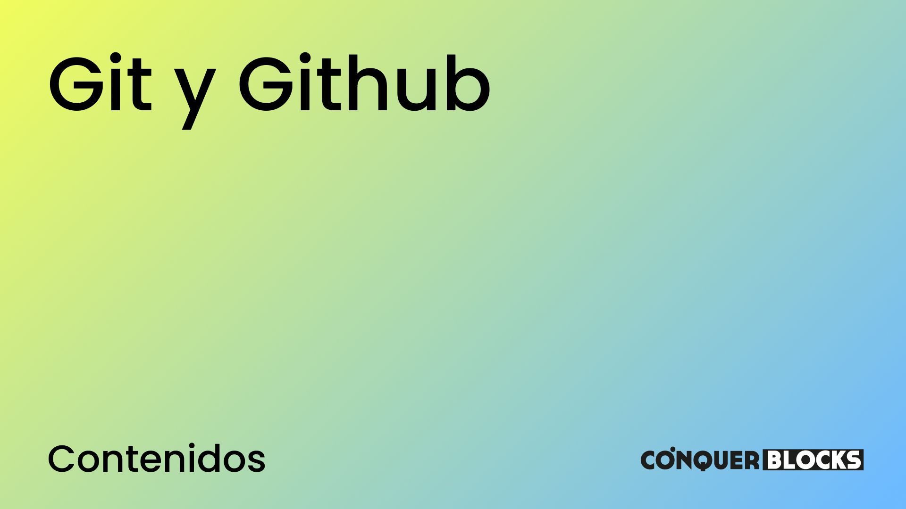

<h1>Máster en Desarrollo FullStack</h1>

<h2>Repositorio creado para el módulo de JS para Máster de Desarrollo FullStack</h2>

<h4>Material de las clases</h4>
<ul>
    <li><a target="_blank" href="./00_indice_modulo/Git y Github - Contenidos.pdff">Índice de contenidos del módulo</a></li>
    <li><a target="_blank" href="./01_clases/Git - Clase 02 Prepara tu terminal como un Pro en Windows/Git - Clase 02 Prepara tu terminal como un Pro en Windows.pdf">Git - Clase 02 Prepara tu terminal como un Pro en Windows</a></li>
    <li><a target="_blank" href="./01_clases/Git - Clase 03 Instalacion y configuracion/Git - Clase 03 Instalacion y configuracion.pdf">Git - Clase 03 Instalacion y configuracion</a></li>
    <li><a target="_blank" href="./01_clases/Git - Clase 04 Creación de un repositorio y primeros comandos/Git - Clase 04 Creacion de un repositorio y primeros comandos.pdf">Git - Clase 04 Creación de un repositorio y primeros comandos</a></li>
    <li><a target="_blank" href="./01_clases/Git - Clase 05 Ramas, Staging  y Git Log/Git - Clase 05 Ramas, Staging  y Git Log.pdf">Git - Clase 05 Ramas, Staging  y Git Log</a></li>
    <li><a target="_blank" href="./01_clases/Git - Clase 06 Ejercicio practico con ramas/Git - Clase 06 Ejercicio practico con ramas.pdf">Git - Clase 06 Ejercicio practico con ramas</a></li>
</ul>
